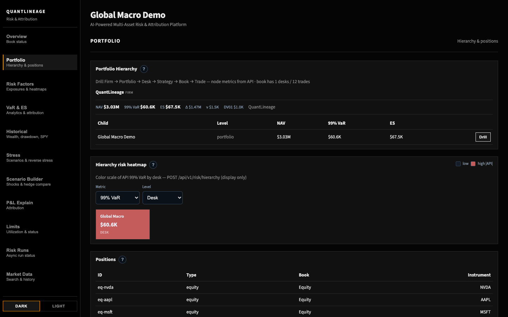
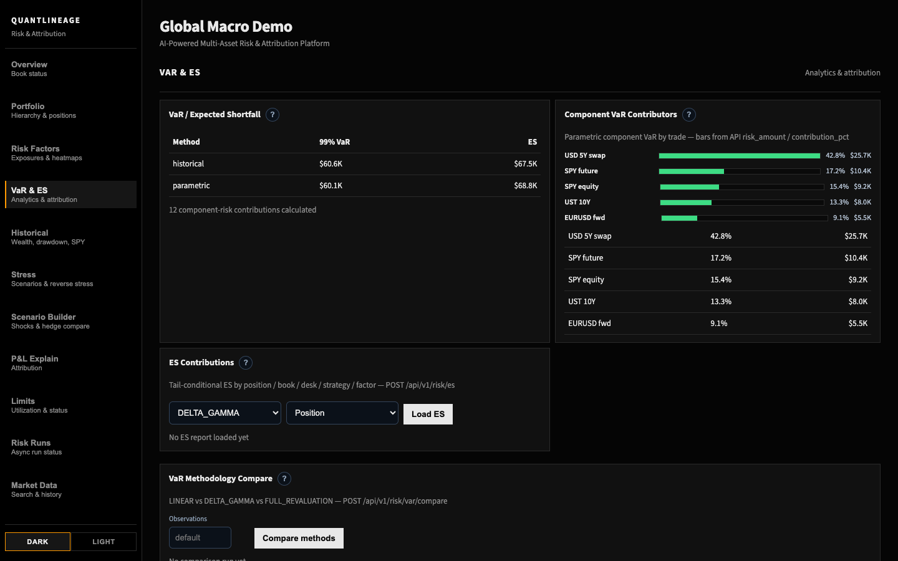
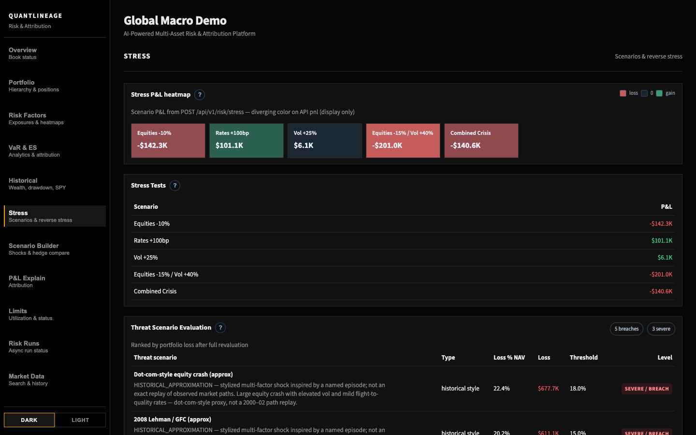
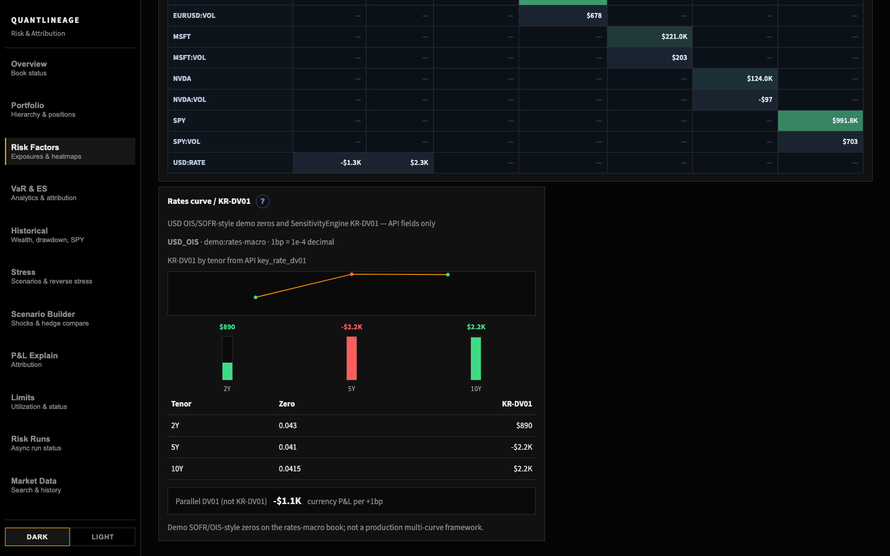

# Final Portfolio Demo

This runbook is the deterministic 3-5 minute **artifact** path for a clean checkout. It reuses the demo portfolios and `run_demo_risk` artifact generator. Risk numbers must come from generated API/script artifacts only; do not copy or invent values in the narrative. The Stage 10.4 5–8 minute institutional UI story (Compare T0/T1, hedge, provenance, limitations) is [`../demo_script.md`](../demo_script.md) and [`golden_demo.md`](golden_demo.md).

## Scope

- Demo books: `equity-vol`, `rates-macro`, `global-macro`.
- Historical data: packaged `data/demo_multi_factor_history.csv` per-factor synthetic replay (four-macro `data/demo_historical_factors.csv` remains a labeled fixture).
- Deterministic artifact: `data/demo_risk_artifact.json`.
- Artifact path: builtin pricing adapter, Python scenario kernel, caches disabled.
- No live market-data vendors or LLM-computed risk values.

## Clean-Checkout Prerequisites

From a fresh clone:

```bash
cd backend
python3.12 -m venv .venv
source .venv/bin/activate
pip install -r requirements.txt
```

For a CI-style artifact smoke, run from the repo root after dependencies are installed:

```bash
PYTHONPATH=backend backend/.venv/bin/python scripts/check_final_demo.py
```

Expected result: JSON with `"status": "ok"`, the three portfolio ids, builtin pricing, `demo-multi-factor-history`, and `scenario_count` matching the committed default scenario set. The check writes a temporary artifact, verifies `--check` double-run determinism, and asserts byte equality with `data/demo_risk_artifact.json`.

To regenerate the committed artifact intentionally:

```bash
cd backend
PYTHONPATH=. QUANTLINEAGE_PRICING_ENGINE=builtin QUANTLINEAGE_PRICING_CACHE=0 \
  QUANTLINEAGE_CURVE_CACHE=0 QUANTLINEAGE_SCENARIO_CACHE=0 \
  QUANTLINEAGE_SCENARIO_KERNEL=python \
  .venv/bin/python -m app.demo.run_demo_risk \
  --check -o ../data/demo_risk_artifact.json
```

Expected stable artifact: `data/demo_risk_artifact.json` with sorted keys and rounded floats. Review values directly from that file during the demo.

## Screenshots

The screenshots below were captured from the local app against the deterministic demo API path.










## Expected Ranges

These ranges are derived from `data/demo_risk_artifact.json` and should be treated as demo guardrails, not independent valuation references.

- All demo portfolios: market value ranges from `$864K` to `$4.12M`.
- All demo portfolios: 99% VaR ranges from `$11.6K` to `$44.1K`.
- All demo portfolios: 99% Expected Shortfall ranges from `$13.1K` to `$51.9K`.
- Default `global-macro` portfolio: market value is about `$2.63M`, 99% VaR is about `$44.1K`, and 99% Expected Shortfall is about `$51.9K`.
- Default `global-macro` exposures: delta is about `$1.12M`, DV01 is about `$1.1K`, and vega is about `$1.3K`.
- Default `global-macro` stress P&L ranges from about `+$91.9K` on `Rates +100bp` to about `-$152.4K` on `Equities -15% / Vol +40%`.

### QuantLib vs builtin artifact bands (QA-024)

The committed artifact is **builtin**. A QuantLib rebuild is **not** byte-identical (swap NPV/DV01 conventions differ). Nightly `quantlib-e2e` runs `backend/tests/test_qa024_ql_demo_range.py`:

- `market_value` and named stress P&Ls: within **25%** relative of the artifact, with a **$1** absolute floor for near-zero P&Ls.
- `var_99`: within **`[0.25×, 4×]`** of the artifact. Observed QuantLib/builtin ratio on the rates-macro book is about **2.9×**; the upper bound leaves headroom for QuantLib version drift without allowing collapse or a 5× blow-up.

These QuantLib bands are CI guardrails against a wrong engine or empty book, not a claim that builtin and QuantLib VaR match.

## 3-5 Minute Flow

1. Start with the portfolio catalog.
   Command/API: `GET /api/v1/portfolios`.
   Talk track: three themed books are embedded for reproducible demos, not live vendor data.

2. Open the default Cross-Asset book.
   Command/API: `GET /api/v1/portfolio` or `GET /api/v1/portfolios/global-macro`.
   Screenshot: `quantlineage_demo_02_portfolio.png`.
   Talk track: firm/desk/strategy/book metadata is part of the sample book.

3. Show risk summary and VaR/ES.
   Artifact section: `portfolios[].summary` and `portfolios[].var_report`.
   Screenshot: `quantlineage_demo_03_var_es.png`.
   Talk track: Historical VaR uses the packaged synthetic replay; methodology is `DELTA_GAMMA` in the artifact.

4. Show stress scenarios.
   Artifact section: `portfolios[].stress`.
   Screenshot: `quantlineage_demo_04_stress.png`.
   Talk track: default scenarios are deterministic scenario definitions; the artifact omits per-position stress detail to stay small.

5. Close with reproducibility.
   Command: `scripts/check_final_demo.py`.
   Talk track: a clean checkout can regenerate the same artifact byte-for-byte using local deterministic inputs.
